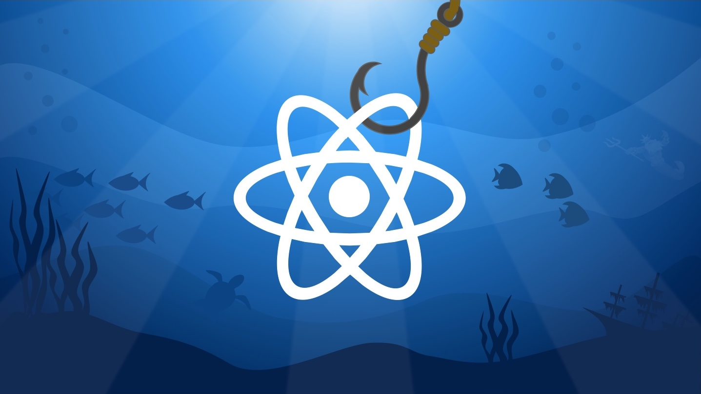

### React Hooks Tutorial - Master React Hooks Development

The official code for the *React Hooks Tutorial - Master React Hooks Development* course on Udemy by David Katz.

## Take the course here:
**[http://udemy.com/react-hooks-tutorial](http://udemy.com/react-hooks-tutorial)**

React Hooks are the biggest update to React that the framework has ever seen. In short, they're a way for function components to "hook" into React functionality. With hooks, you may never write a class-based React compnent again! Master React Hooks the right way. Learn what they are, how they work under the hood, and why they're so revolutionary!

Here are the main course highlights:
- Dive into react hooks right away, and waste no time getting writing code with hooks.
- Updated for 2022-2023: Learn how to code with React JS and React Hooks from an engineer with 5+ years of industry experience.
- Take a step back and see how React hooks work under the hood.
- Create compelling React apps while building features based on hooks.
- Reflect on why hooks were introduced and why they’re a better model for how the React engine really works.
- Build more complex apps with more advanced hooks.

